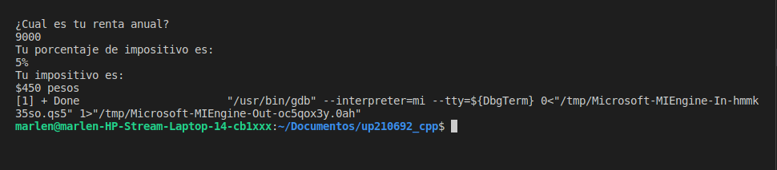
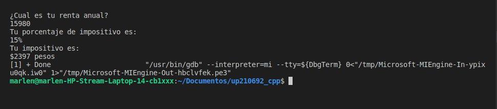

# EXERCISE 1

### The next program shows the corresponding tax according to the annual rent.

| RENT | TAX |
|-------|----------|
|Less than $10,000| 5% |
|Between $10,000 and $20,000| 15% |
|Between $20,000 and $35,000| 20% |
|Between $35,000 and $60,000| 30% |
|More than $60,000| 45% |

```c++
//Libraries and main function
#include <iostream>
using namespace std;
int main() {
//Declaret the variables
    int renta;
    float impuesto;
    cout << "¿Cual es tu renta anual? \n";
    cin >> renta;
//First cycle for rent less than $10,000
    if(renta < 10000){
        cout << "Tu porcentaje de impositivo es: \n5%";
        impuesto = renta*.05;
    }
//Second cycle for rent between $10,000 and $20,000
    if((renta >= 10000) && (renta < 20000)){
        cout << "Tu porcentaje de impositivo es: \n15%";
        impuesto = renta*.15;
    }
//Third cycle for rent between $20,000 and $35,000
    if((renta >= 20000) && (renta < 35000)){
        cout << "Tu porcentaje de impositivo es: \n20%";
        impuesto = renta*.20;
    }
//Four cycle for rent between $35,000 and $60,000
    if((renta >= 35000) && (renta < 60000)){
        cout << "Tu porcentaje de impositivo es: \n30%";
        impuesto = renta*.30;
    }
//Last cycle for rent more than $60,000
    if( renta >= 60000){
        cout << "Tu porcentaje de impositivo es: \n45%";
        impuesto = renta*.45;
    }
//Imprention of the impositive
    cout << "\nTu impositivo es: \n$" << impuesto << " pesos" << endl;
    return 0;
}
    
```
## CODE TESTS
### Rent less than $10,000


### Rent between $10,000 and $20,000


### Rent between $20,000 and $35,000


### Rent between $35,000 and $60,000


### Rent more than $60,000
 


# EXERCISE 2

### The next code shows acording to the user's score, prints the performance level and the money that the user will recieve.

LEVEL | SCORE
------|------
Unacceptable| 0.0
Acceptable| 0.4
Meritorious| 0.6 o more

```c++
//Libraries and main function
#include <iostream>
using namespace std;
int main (){
//Declaret the variables
    float puntuacion;
    float inaceptable = 0.0;
    float aceptable = 0.4;
    float meritorio = 0.6;
    double dinero;
//Ask to te user the score and we keep in the variable "puntuacion"
cout << "¿Cual es tu puntuación? \n";
cin >> puntuacion;
// First cycle for score unacceptable
if ( puntuacion == inaceptable){
    cout << "Tu nivel de rendimiento es inaceptable \n";
    dinero = 2400*inaceptable;
}
// Second cycle for score acceptable
else if (puntuacion == aceptable){
        cout << "Tu nivel de rendimiento es aceptable \n";
        dinero = 2400*aceptable;
}
// Last cycle for score meritorious
else if (puntuacion >= meritorio){
        cout << "Tu nivel de rendimiento es meritorio \n";
        dinero = 2400*meritorio;
}
else cout << "Tu puntuación no es aceptable \n";
// Print the user's benefit
cout << "\nTu ganancia es de:\n$" << dinero << " pesos" << endl;
return 0;
}
```
## CODE TESTS

### For score 0.0
 

### For score 0.4
### For score 0.6 or more