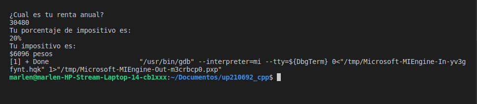
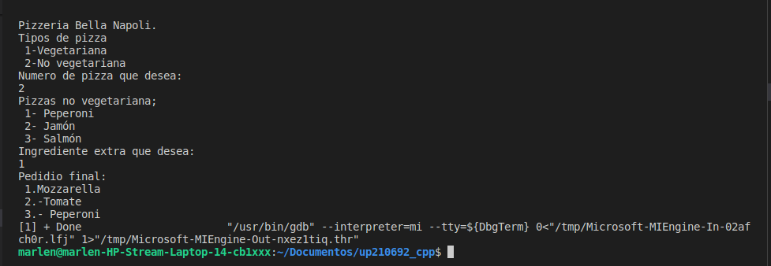

# EXERCISE 1

### The next program shows the corresponding tax according to the annual rent.

| RENT | TAX |
|-------|----------|
|Less than $10,000| 5% |
|Between $10,000 and $20,000| 15% |
|Between $20,000 and $35,000| 20% |
|Between $35,000 and $60,000| 30% |
|More than $60,000| 45% |

```c++
//Libraries and main function
#include <iostream>
using namespace std;
int main() {
//Declaret the variables
    int renta;
    float impuesto;
    cout << "¿Cual es tu renta anual? \n";
    cin >> renta;
//First cycle for rent less than $10,000
    if(renta < 10000){
        cout << "Tu porcentaje de impositivo es: \n5%";
        impuesto = renta*.05;
    }
//Second cycle for rent between $10,000 and $20,000
    if((renta >= 10000) && (renta < 20000)){
        cout << "Tu porcentaje de impositivo es: \n15%";
        impuesto = renta*.15;
    }
//Third cycle for rent between $20,000 and $35,000
    if((renta >= 20000) && (renta < 35000)){
        cout << "Tu porcentaje de impositivo es: \n20%";
        impuesto = renta*.20;
    }
//Four cycle for rent between $35,000 and $60,000
    if((renta >= 35000) && (renta < 60000)){
        cout << "Tu porcentaje de impositivo es: \n30%";
        impuesto = renta*.30;
    }
//Last cycle for rent more than $60,000
    if( renta >= 60000){
        cout << "Tu porcentaje de impositivo es: \n45%";
        impuesto = renta*.45;
    }
//Imprention of the impositive
    cout << "\nTu impositivo es: \n$" << impuesto << " pesos" << endl;
    return 0;
}
    
```
## CODE TESTS
### Rent less than $10,000


### Rent between $10,000 and $20,000


### Rent between $20,000 and $35,000


### Rent between $35,000 and $60,000


### Rent more than $60,000
 


# EXERCISE 2

### The next code shows acording to the user's score, prints the performance level and the money that the user will recieve.

LEVEL | SCORE
------|------
Unacceptable| 0.0
Acceptable| 0.4
Meritorious| 0.6 o more

```c++
//Libraries and main function
#include <iostream>
using namespace std;
int main (){
//Declaret the variables
    float puntuacion;
    float inaceptable = 0.0;
    float aceptable = 0.4;
    float meritorio = 0.6;
    double dinero;
//Ask to te user the score and we keep in the variable "puntuacion"
cout << "¿Cual es tu puntuación? \n";
cin >> puntuacion;
// First cycle for score unacceptable
if ( puntuacion == inaceptable){
    cout << "Tu nivel de rendimiento es inaceptable \n";
    dinero = 2400*inaceptable;
}
// Second cycle for score acceptable
else if (puntuacion == aceptable){
        cout << "Tu nivel de rendimiento es aceptable \n";
        dinero = 2400*aceptable;
}
// Last cycle for score meritorious
else if (puntuacion >= meritorio){
        cout << "Tu nivel de rendimiento es meritorio \n";
        dinero = 2400*meritorio;
}
else cout << "Tu puntuación no es aceptable \n";
// Print the user's benefit
cout << "\nTu ganancia es de:\n$" << dinero << " pesos" << endl;
return 0;
}
```
## CODE TESTS

### For score 0.0
 

### For score 0.4
 

### For score 0.6 or more
 

# EXERCISE 3

### The next code shows the price of the cinema's tickets acording to their ages 

 Age | Price 
-----|-------
 Less than 4 years | Free 
 Between 4 and 18 years | $5 
 More than 18 years | $10 

 ```c++
 //Libraries and main function
 #include <iostream>
using namespace std;
int main (){
//Declaret the variables
    int precio;
    int edad;
//Ask to the user their age
    cout << "¿Cuál es tu edad?\n";
    cin >> edad;
//First cycle for less than 4 fears
if (edad < 4){
        cout << "Tu entreda es gratis\n";
}
//Second cycle for between 4 and 18 years
else if ((edad >=4) && (edad <= 18)){
        cout << "Tu entrada es de $5 pesos\n";
}
//Third cycle for more than 18 years
else if (edad > 18){
        cout << "Tu entrada es de $10 pesos \n";
    
}

return 0;
}
```
## CODE TESTS

### Less than 4 years


### Between 4 and 18 yeras


### More than 18 years 


# EXERCISE 4

### This code shows the menu for a vegetarian or no vegetarian pizza, and print the submenu acording to the type of pizza for a ingredient extra

```c++
//Libraries and main function
#include <iostream>
using namespace std;
int main (){
//Declaret the variables
    int ingrediente;
    int tipo;
cout<<"Pizzeria Bella Napoli.\nTipos de pizza\n 1-Vegetariana\n 2-No vegetariana\n";
//Ask to the user the pizza type
cout << "Numero de pizza que desea:\n";
cin >> tipo;
//First cycle for vegetarian pizza
if (tipo == 1){
    cout <<"Pizza vegetarianas:\n 1-Pimiento\n 2-Tofu\n";
    cout <<"Numero de ingrediente extra que desea:\n";
    cin >> ingrediente;
//Cycle for a pimient as a extra ingredient
    if (ingrediente == 1){
        cout <<"Pedido final: \n 1.-Mozzarella\n 2.-Tomate\n 3.-Pimiento"<<endl;
    }
//Cycle for a tofu as a extra ingredient
    else if (ingrediente == 2){
        cout <<"Peidio final: \n 1.-Mozzarella\n 2.-Tomate\n 3.-Tofu"<<endl;
    }
    else cout << "Ingrediente no disponible\n";
}
//Cycle for no vegetarian pizza
else if (tipo == 2) {
    //pizza no vegetariana
    cout<<"Pizzas no vegetariana;\n 1- Peperoni\n 2- Jamón\n 3- Salmón\n";
    cout <<"Ingrediente extra que desea: \n";
    cin >> ingrediente;
//Cycle for peperoni as a ingredient extra
    if (ingrediente == 1){
        cout << "Pedidio final: \n 1.Mozzarella \n 2.-Tomate \n 3.- Peperoni\n";
    }
//Cycle for jamon as a ingredient extra
    else if (ingrediente == 2){
        cout << "Pedidio final: \n 1.Mozzarella \n 2.-Tomate \n 3.- Jamon\n";
    }
//Cycle for salmon as a ingredient extra
    else if (ingrediente == 3){
        cout <<"Pedidio final: \n 1.-Mozarrella \n 2.-Tomate \n 3.-Salmon\n";
    }
    else cout << "Ingrediente no disponible\n";
}   
    
else cout << "Pizza inexistente\n";
    return 0;
}
```
## CODE TEST

### Vegetarian pizza with pimiento as a ingredient extra


### Vegetarian pizza with tofu as a ingredient extra


### No vegetarian pizza with peperoni as a ingredient extra


### No vegetarian pizza with jamon as a ingredient extra


### No vegetarian pizza with salmon as a ingredient extra


# EXERCISE 5

### This code shows the mean of 6 temperatures and the temperature highest and more low

```c++

```

# EXERCISE 6 

### This code shows the total in a facture of the prodects ingresed for the user

```c++

```
# EXERCISE 7
### This code do the conversion of the system decimal to binario 
```c++

```
# EXERCISE 8
### This code show the multiplication table of the number the user ingresed

```c++

```