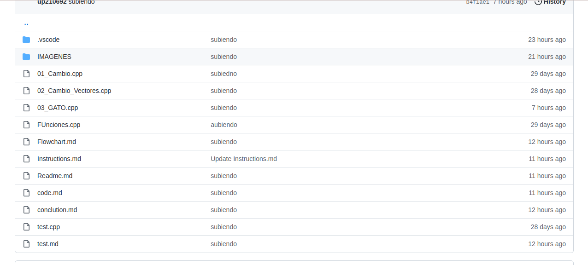
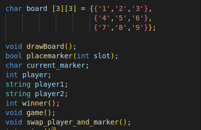
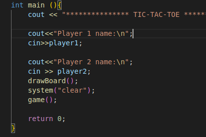

# INSTRUCTION FOR EDIT

1. Download or clone my repo with the following command in the terminal:
* https://github.com/UP210692/up210692_cpp.git
2. In this repo you see the program in the unit 3 the document with the name 03_GATO.CPP

3. To run this program, type:
* ./03_GATO.cpp

# CODE EXECUTION

PREPROCESOR DIRECTIVES

PROTOTYPE FUNCTIONS AND VARIABLE DECLARATIONS

MAIN FUNCTION

[Return to index](https://github.com/UP210692/up210692_cpp/blob/main/U3/Readme.md)
