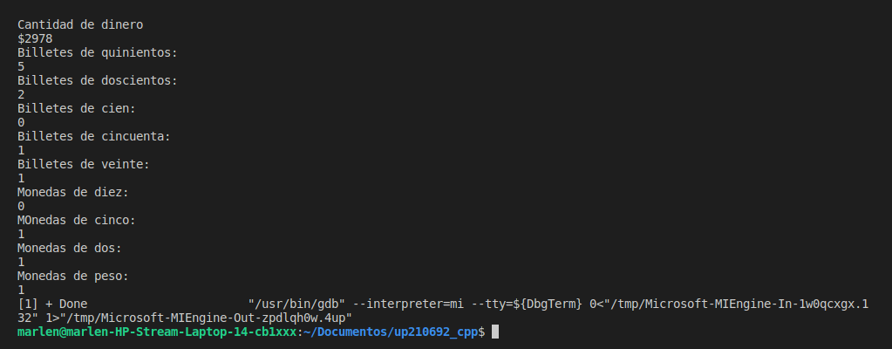

# EXCERSISE 1
### This code show the exchange of money into bills and coins

```c++
//Libraries
#include <iostream>
using namespace std;
//Inisialitation of the variables
int quinientos = 0, dosientos = 0, cien = 0;
int cincuenta = 0, veinte = 0;
int diez = 0, cinco = 0, dos = 0, uno = 0;
//Main function
int main(){
int dinero;
int residuo;
cout << "Cantidad de dinero \n"<<"$";
cin >> dinero;
//Calculate of the change
quinientos = dinero/500;
residuo = dinero%500;
cout <<"Billetes de quinientos:\n" << quinientos << endl;
dosientos = residuo/200;
residuo = residuo%200;
cout << "Billetes de doscientos:\n"<<dosientos<<endl;
cien = residuo/100;
residuo = residuo%100;
cout << "Billetes de cien:\n"<<cien<<endl;
cincuenta = residuo/50;
residuo = residuo%50;
cout << "Billetes de cincuenta:\n"<<cincuenta<<endl;
veinte = residuo/20;
residuo = residuo%20;
cout << "Billetes de veinte:\n"<<veinte<<endl;
diez = residuo/10;
residuo = residuo%10;
cout << "Monedas de diez:\n"<<diez<<endl;
cinco = residuo/5;
residuo = residuo%5;
cout << "MOnedas de cinco:\n"<<cinco<<endl;
dos = residuo/2;
residuo = residuo%2;
cout << "Monedas de dos:\n"<<dos<<endl;
uno = residuo/1;
residuo = residuo%1;
cout << "Monedas de peso:\n"<<uno<<endl;

return 0;
}
```
## CODE TEST
###The user ingresed the mount of 2978


