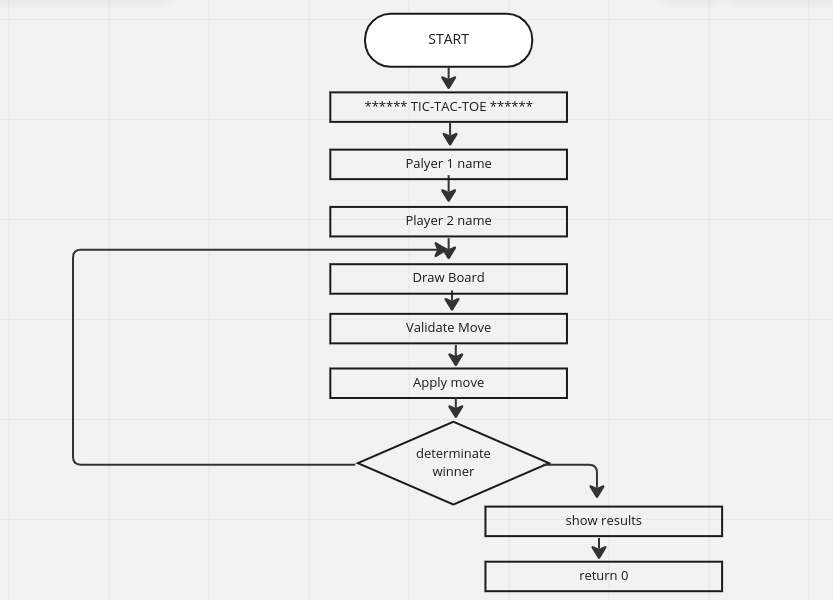
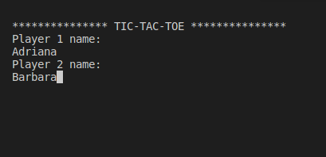
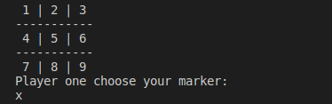
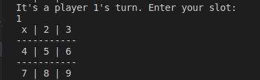
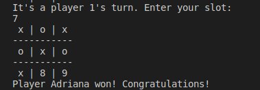

# TIC TAC TOE

The current program is a representation of "Tic Tac Toe", a game in which two players seek in alternate turns to complete a row, a column, or a diagonal with either three O's or three X's drawn in the spaces of a grid of nine squares.

This is a game for two players and to play against CPU too. But in this code only can play two player vs player.

## CONTENT

* [Instructions for execution and use]()
* [Flowchart]()
* [Tests]()
* [Conclusion]()

## INSTRUCTION FOR EXECUTION 

### LINUX

1. Download or clone my repo with the following command in the terminal:
* https://github.com/UP210692/up210692_cpp.git
2. Install GNU c/c++ compiler, open the terminal and type:
* $ sudo apt-get update

* $ sudo apt-get install build-essential manpages-dev
3. To compile this program, type:
* gcc 04_Gato.c -o 04_Gato
4. To run this program, type:
* ./04_Gato

### FLOWCHART

### TESTS

The first thing that appear on the screen is space to save player names

Then a space for player 1 to select his/her marker

Then the board appears on the screen for the players to select their plays (slot).

So it will appear successively until it is a winner.
Just like the winner will appear on the screen

### CONCLUTION

This program was somewhat difficult but fun because I was learning the logic of the game as well as new functions of the programming language (c++).
I couldn't do the full practice because I also had to do the player vs computer option but I couldn't do it, I tried but it didn't work. But i could try to do it again, although it doesn't count for practice.